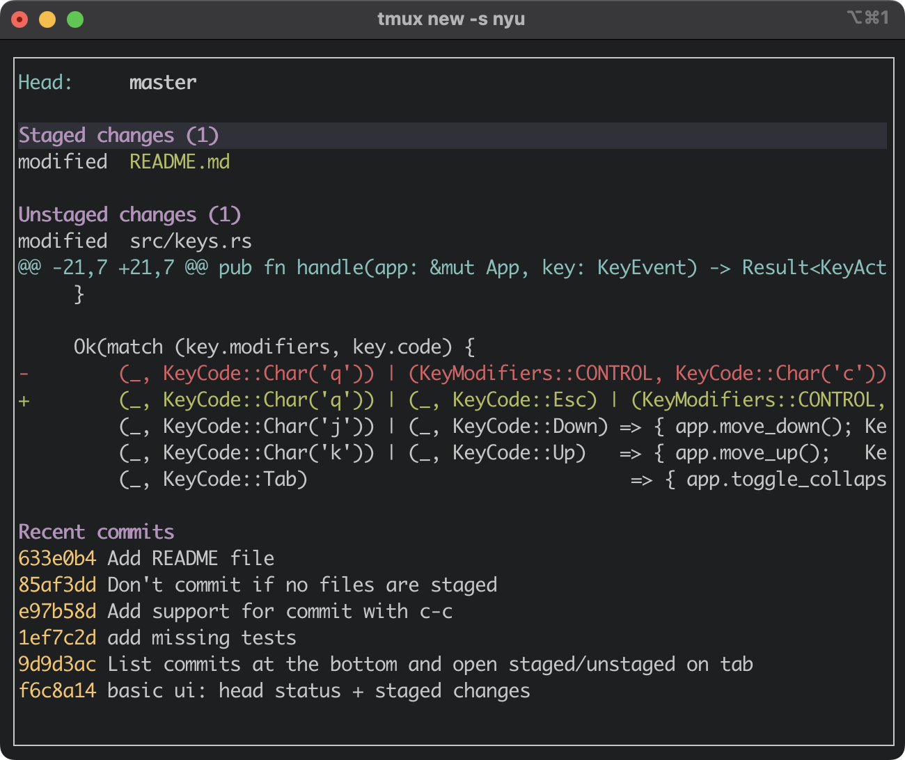

# maguito

A fast git TUI inspired by Magit



## Install

```bash
cargo install --path .
```

## Usage

Run from any git repository:

```bash
maguito
```

Or bind it in `~/.tmux.conf` as a popup (press `Esc` or `q` to close):

```
bind-key g display-popup -E -d "#{pane_current_path}" -w 90% -h 90% "maguito"
```

## Keys

| Key       | Action                                    |
| --------- | ----------------------------------------- |
| `j` / `k` | Move down / up                            |
| `Tab`     | Expand or collapse section, file, or hunk |
| `s`       | Stage file or hunk under cursor           |
| `u`       | Unstage file or hunk under cursor         |
| `c c`     | Commit staged changes                     |
| `g`       | Refresh                                   |
| `q` / `Esc` | Quit                                    |
